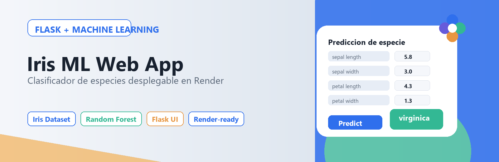

# ML Web Application with Flask



**Language / Idioma:** English | [Español](README.es.md)

This project trains a Machine Learning model with the **UCI Iris Dataset** and integrates it into a **Flask** web application. The interface accepts flower measurements and predicts the Iris species: `setosa`, `versicolor`, or `virginica`.

## Goals

- Find and understand a simple dataset.
- Train and optimize a Machine Learning model.
- Analyze results and feature importance.
- Build a Flask web interface for the model.
- Prepare the project for Render deployment.

## Dataset

The project uses the **UCI Iris Dataset**, loaded through `sklearn.datasets.load_iris`.

Features:

- `sepal_length_cm`
- `sepal_width_cm`
- `petal_length_cm`
- `petal_width_cm`

Target:

- `species`

## Model

The training pipeline uses:

- `StandardScaler`
- `RandomForestClassifier`
- `GridSearchCV` for hyperparameter optimization

Results are saved in:

- `models/iris_metrics.json`
- `reports/figures/`

## Flask App

Main app:

```text
app.py
```

Routes:

- `/` prediction form.
- `/health` service check.

## Structure

```text
.
├── app.py
├── data/
│   ├── raw/iris.csv
│   └── processed/
│       ├── train.csv
│       └── test.csv
├── models/
│   ├── iris_classifier.joblib
│   └── iris_metrics.json
├── reports/figures/
│   ├── app_banner.png
│   ├── feature_importance.png
│   ├── petal_scatter.png
│   └── species_distribution.png
├── src/
│   ├── app.py
│   ├── explore.ipynb
│   └── utils.py
├── static/styles.css
├── templates/index.html
├── Procfile
├── render.yaml
└── requirements.txt
```

## Run Locally

```bash
pip install -r requirements.txt
python src/app.py
python app.py
```

Then open:

```text
http://localhost:5000
```

## Render

The repository includes `Procfile` and `render.yaml`.

Steps:

1. Create a new Web Service on Render.
2. Connect this GitHub repository.
3. Use:
   - Build Command: `pip install -r requirements.txt`
   - Start Command: `gunicorn app:app`
4. Paste the public Render URL here after creating the service.

Render URL:

```text
Pending after creating the Render service.
```

## External Resources

- UCI Iris Dataset via scikit-learn.
- Flask documentation.
- Render Web Services documentation.
